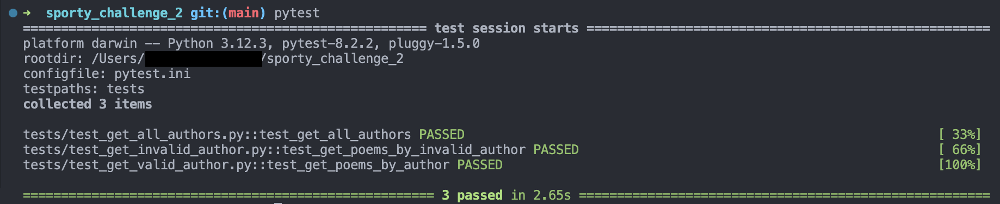

# sporty_challenge_2
This repository contains the second QA challenge development

The RestAPI selected was [PoetryDB](https://github.com/thundercomb/poetrydb#readme).

## Test Cases Developed

| Test Case | Description | Steps | Expected Results |
|:---------:|:-----------:|:-----:|:----------------:|
| `test_get_all_authors` | Test to get all authors from the PoetryDB API | 1. Send a GET request to the /author endpoint. 2. Verify the response status code is 200. 3. Check that the list is not empty.  4. Verify the response contains a list of authors. | 1. Response status code is 200. 2. List is not empty. 3. Response contains an authors list. |
| `test_get_valid_author` | Test to get poems by a valid author from the PoetryDB API | 1. Send a GET request to the /author/{valid_author_name} endpoint. 2. Verify the response status code is 200. 3. Check that the list is not empty. 4. Verify the response contains a list of poems. 5. Verify each poem has an 'author' key with value 'Valid Author Name'. 6. Verify each poem has a 'lines' key and its value is a list. | 1. Response status code is 200 for valid author 'William Shakespeare'. 2. The list is not empty. 3. Response contains a list of poems. 4. Each poem has 'author' key with value 'William Shakespeare'. 5. Each poem has 'lines' key and its value is a list. |
| `test_get_invalid_author` | Test to handle an invalid author request from the PoetryDB API | 1. Send a GET request to the /author/{invalid_author_name} endpoint. 2. Verify the response status code is 200. 3. Verify the response contains status and reason. | 1. Response status code is 200. 2. The 'status' in the response contains an error code 404. 3. The 'reason' in the response contains a 'Not found' message. |

## Test Run Evidence
One can see below the run result:

